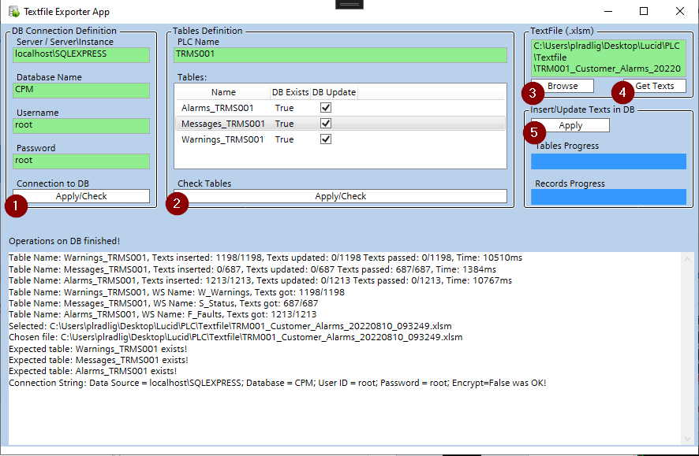

# TextFileExport
An app that allows to insert or update data from excel (textfile) to DataBase. Database first.

(1) Check connection (connection string defined with data typed by user) with DB \
(2) Check tables (program expect predefined tables changed with _PLCName extension) \
(3) Browse for textfile \
(4) Get texts from textfile (program expects predefined sheet names equivalent to tables name) \
(5) Insert/update/pass got texts to DB. Progress of operations is shown by progress bars
